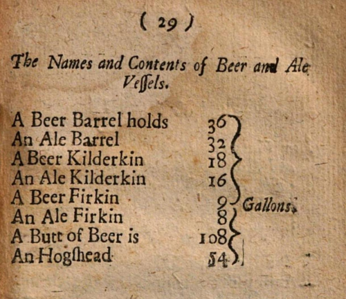

# aButtTonOfSqlQuestions

A-Level Computer Science SQL practice repository.

This repo is designed as a central place for students to practice SQL queries using local SQLite databases and Jupyter notebooks.

## Fun fact

A Butt is a real, if obscure, unit of measurement for wine casks, approximately 126 gallons or 477 liters. It was historically used in the wine trade and is still referenced in some contexts today.

Reference: https://en.wikipedia.org/wiki/Butt_(unit)

## Repository goals

- Store SQLite datasets used to generate SQL exercises.
- Provide notebook templates for consistent classroom practice.
- Keep setup simple for students and teachers.

## Recommended VS Code extensions

This repository includes workspace recommendations for:

- Python
- Jupyter

When opening the repo in VS Code, install the recommended extensions if prompted.

## Python setup

1. Create and activate a virtual environment.
2. Install dependencies:

	pip install -r requirements.txt

These dependencies include support for running SQL in notebooks via ipython-sql.

## Notebook usage

Open the template notebook in notebooks/template_sql_exercises.ipynb.

The Uber practice notebooks live in notebooks/uber_sql_exercise_01/.

Typical notebook setup cell for SQLite:

%load_ext sql
%sql sqlite:///datasets/sqlite/example.db

Then run SQL queries with:

%%sql
SELECT *
FROM your_table
LIMIT 10;

## Layout

- datasets/sqlite/: SQLite database files for exercises.
- notebooks/: Notebook templates and exercise sets.
- requirements.txt: Python dependencies for notebook + SQL work.
