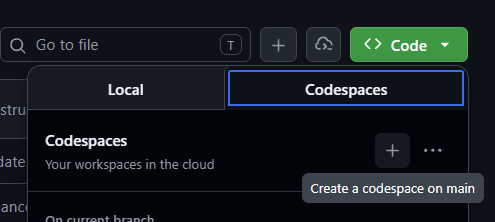
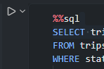
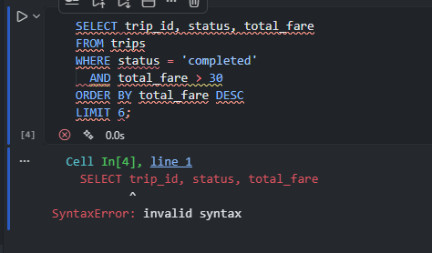
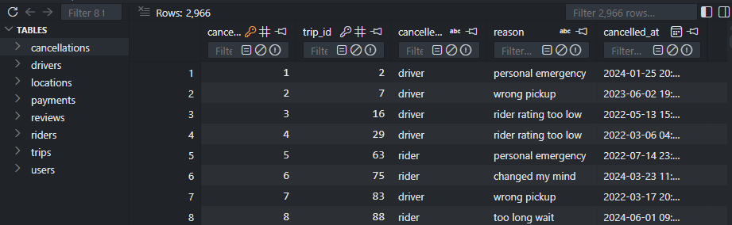

# A Butt-Ton of SQL Questions

A-Level Computer Science SQL practice repository.

This repo is designed as a central place for A-Level students to practice SQL queries using local SQLite databases and Jupyter notebooks.

It is designed to be a one stop shop with a pre-configured devcontainer environment that includes all necessary tools and libraries to get started with SQL practice immediately.

- [A Butt-Ton of SQL Questions](#a-butt-ton-of-sql-questions)
  - [Fun fact](#fun-fact)
  - [How to use this resource](#how-to-use-this-resource)
    - [1. Open this repository in a GitHub Codespace (below) or clone the repo to your local machine:](#1-open-this-repository-in-a-github-codespace-below-or-clone-the-repo-to-your-local-machine)
    - [2. Choose a notebook to practise with](#2-choose-a-notebook-to-practise-with)
    - [3. Select the correct Jupyter kernel](#3-select-the-correct-jupyter-kernel)
    - [4. Write your SQL queries](#4-write-your-sql-queries)
    - [4. Viewing the datasets](#4-viewing-the-datasets)
  - [Currently Available Notebooks](#currently-available-notebooks)

## Fun fact

A Butt is a real, if obscure, unit of measurement for wine casks, approximately 126 gallons or 477 liters. It was historically used in the wine trade and is still referenced in some contexts today.

Reference: https://en.wikipedia.org/wiki/Butt_(unit)

## How to use this resource

### 1. Open this repository in a GitHub Codespace (below) or clone the repo to your local machine:

Opening in Codespaces:

This is the recommended way to use this resource, as it provides a pre-configured environment with all necessary tools and libraries installed, allowing you to start practicing SQL immediately without any setup hassle.

### 2. Choose a notebook to practise with

There are a variety of notebooks available, each containing SQL exercises based on different datasets.

Navigate to the [notebooks](./notebooks/) and choose a notebook. Open the one with the `student` suffix to write your answers in, and the one with the `solution` suffix to view the correct SQL queries for reference.

### 3. Select the correct Jupyter kernel

To run your code, you need to select the correct Jupyter kernel for the notebook. 

1. Click on the kernel name in the top right corner of the notebook (it may say "Python 3" or something similar). You are looking for this icon: 

2. Select `Python Environment` from the dropdown menu.

3.Choose the kernel that starts with `.venv`.

### 4. Write your SQL queries

Write your SQL queries in the exercise cells and run them, by pushing the play button to the left of the cell to see the results. You can compare your answers with the provided solutions in the corresponding solution notebooks.

⚠️ **IMPORTANT**: You need to leave the `%%sql` string in the exercise cells to execute your SQL queries. 

Here's what it looks like when you run a cell with the `%%sql` magic command:

And here's what it looks like when you run a cell without the `%sql` string:

### 4. Viewing the datasets

To help you construct your queries, you can view the structure of the tables by navigating to [datasets](./datasets/sqlite/) and clicking on the file corresponding to the notebook you're working on. 

This should open the databse using the pre-installed `SQLite Viewer` extension.

## Currently Available Notebooks

 - [Uber Rideshare Dataset](./notebooks/uber_sql_exercise_01/uber_sql_exercise_01_students.ipynb) - A dataset containing information about Uber rides, including pickup and dropoff locations, timestamps, and fare amounts.
 - [The IMDB Movie Dataset](./notebooks/imdb_sql_exercise_01/imdb_sql_exercise_01_students.ipynb) - A dataset containing information about movies, including titles, release years, genres, and ratings.

